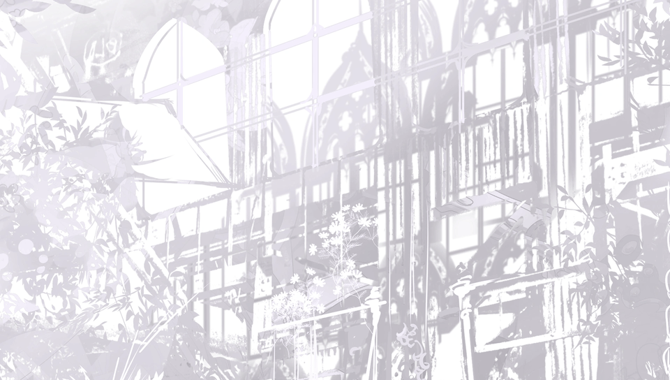

<h1 align="center">
<br>
Arcaea · PSVita Port
</h1>
<p align="center">
  <a href="#setup-instructions-for-end-users">How to install</a> •
  <a href="#controls">Controls</a> •
  <a href="#build-instructions-for-developers">How to compile</a> •
  <a href="#credits">Credits</a> •
  <a href="#license">License</a>
</p>


Arcaea is a mobile rhythm game developed by lowiro, released on March 9, 2017. The game known for its deep storyline and unique gameplay mechanics; players tap, hold, and slide on a musical arc as they follow notes that appear in time with music. It also features both "sky" and "ground" notes that players must interact with.

The storyline is set in a world of glass where memories take form as crystals, each representing fragments of past lives and emotions. The game's main characters journey through this shattered world, collecting these “Arcaea” fragments to rediscover memories and understand the truth behind the world's ruin.

The primary characters, Hikari and Tairitsu, each have distinct personalities and motivations. At the start, they are companions who share a close bond, but as they explore the world and uncover more memories, tensions grow between them, leading to a divergence in paths. 

This repository contains a loader of **the Android release of Arcaea**, based
on the [Android SO Loader by TheFloW](https://github.com/TheOfficialFloW/gtasa_vita).
The loader provides a tailored, minimalistic Android-like environment to run
the official ARMv7 game executables on the PS Vita.

**This software does not contain the original code, executables, assets, or other
not redistributable parts of the game. The authors do not promote or condone piracy
in any way. To launch and play the game on their PS Vita device, users must provide
their own legally obtained copy of the game in form of an .apk file.**

### Minor notes
- After finishing a play session/before quitting the game, don't quit the game immediately.
  - Wait for around 3 seconds and then quit, otherwise your game may crash or your save data may be corrupted.
  - If you still happen to crash/corrupt your save file, there is a backup inside `ux0:/data/arcaea` folder with the name `SharedPreferences.bin.bak`. Simply remove the `.bak` by renaming and the game should work again, but some progress may be lost.

## Setup Instructions (For End Users)

In order to properly install the game, you'll have to follow these steps precisely:

- Install [kubridge](https://github.com/TheOfficialFloW/kubridge/releases/) and [FdFix](https://github.com/TheOfficialFloW/FdFix/releases/) by copying `kubridge.skprx` and `fd_fix.skprx` to your taiHEN plugins folder (usually `ur0:tai`) and adding two entries to your `config.txt` under `*KERNEL`:
  
```
  *KERNEL
  ur0:tai/kubridge.skprx
  ur0:tai/fd_fix.skprx
```

**Note** Don't install fd_fix.skprx if you're using rePatch plugin!
- Make sure you have `libshacccg.suprx` in the `ur0:/data/` folder on your console. If you don't, follow [this guide](https://samilops2.gitbook.io/vita-troubleshooting-guide/shader-compiler/extract-libshacccg.suprx) to extract it.
- <u>Legally</u> obtain your copy of [Arcaea](https://play.google.com/store/apps/details?id=com.fingersoft.hillclimb&hl=en) for Android in form of an `.apk` file and the data files in the format of `.obb`.
  - The SHA256 hashes of the needed files should match so, you can check them using an online tool if you search it:
    ```text
    e37ee1deb4aa9a6e89abdd3dccf0c3508b65d87decf2a4fcf7488f0ad10f800d  data.obb
    485ab380573f82321b6065952032d2a64279c8f4038bb397f13315360f85df42  libcocos2dcpp.so
    77d35bc643ffeb0bca475eb41176d2043e860f870d2d1b929252045bbc772ec9  libfmodProvider.so
    ```
  - Versions supported: `1.9.3`.
- Open the `.apk` with any zip explorer (like [7-Zip](https://www.7-zip.org/)) and extract `assets` folder from the `.apk` into `ux0:data/arcaea`. Also, extract `libcocos2dcpp.so` and `libfmodProvider.so` from `lib/armeabi-v7a/` in the same directory.
- Place the `.apk` itself inside `ux0:data/assets` and rename to `base.apk`.
- Install [TestDisk](https://www.cgsecurity.org/wiki/TestDisk_Download).
- Create an empty folder named `data` where the `.obb` is downloaded.
- Open the `.obb` by drag and dropping it or opening it from terminal/command line.
- Do these steps specifically:
  - Select `Proceed`.
  - Select `None`.
  - You should see a partition list with first entry of `FAT16`. Select `Boot`.
  - Select `List`.
  - Press `a`, then `Shift + c`, then go inside `data`, and again `Shift +c`.
  - You should receive a green text saying `Copy done! 1223 ok, 0 failed`.
  - Quit the program.
- Install [Total Commander](https://www.ghisler.com/download.htm) and its [PSARC plugin](http://totalcmd.net/plugring/PSARC.html).
- Launch Total Commander and navigate up to the folder you just created.
- Select all the files and directories inside the folder, click on File -> Pack.
- Set `psarc` as Compressor and then click on `Configure` button right below.
- Set `PSARC Version` to `1.3`, `Compression` to `ZLIB` and `Ratio` to `0` and press `OK`
- Press `OK` to launch the compression, it will create a file in `C:\data.psarc`. (If you get an error, manually change the location in the command line string `psarc: DESTINATIONFOLDER\data.psarc`).
- Transfer it to `ux0:data/arcaea/`.

  Your final folder layout should look like:
  ```
   └── arcaea/
    ├── assets/
    ├── libcocos2dcpp.so
    ├── libfmodProvider.so
    ├── data.psarc
    └── base.apk
  ```
- Install `arcaea.vpk` (from [Releases](https://github.com/memory-hunter/arcaea/releases/latest)).

Controls
-----------------

It only has touch support. No buttons are used.

## Build Instructions (For Developers)

In order to build the loader, you'll need a [vitasdk](https://github.com/vitasdk) build fully compiled with softfp usage.
You can get your environment started nicely by following [Rocroverss's Vita .so porting guide](https://github.com/Rocroverss/vitasoguide?tab=readme-ov-file#section2).
Everything that is required should be available after installing your environment by following the instructions in the README.md of the guide.

After all these requirements are met, you can compile the loader with the following commands:

```bash
cmake -B build .
cmake --build build
```

## Credits
- [Andy "The FloW" Nguyen](https://github.com/TheOfficialFloW/) for the original .so loader.
- [Rinnegatamante](https://github.com/Rinnegatamante/) for VitaGL and lots of help with understanding and debugging the loader.
- [gl33ntwine](https://github.com/v-atamanenko/) for the [SoLoBoP (.**so** **lo**ader **bo**iler**p**late)](https://github.com/v-atamanenko/soloader-boilerplate/), help with the SharedPreferences parsing functions, this README.md as a template copied from [Baba is You! port](https://github.com/v-atamanenko/baba-is-you-vita/) and overall help.
- **masteroga** for requesting this game and giving me a PS Vita ****** (😉) as a reward for it!

## License
This software may be modified and distributed under the terms of
the MIT license. See the [LICENSE](LICENSE) file for details.

[cross]: https://raw.githubusercontent.com/v-atamanenko/sdl2sand/master/img/cross.svg "Cross"
[circl]: https://raw.githubusercontent.com/v-atamanenko/sdl2sand/master/img/circle.svg "Circle"
[squar]: https://raw.githubusercontent.com/v-atamanenko/sdl2sand/master/img/square.svg "Square"
[trian]: https://raw.githubusercontent.com/v-atamanenko/sdl2sand/master/img/triangle.svg "Triangle"
[joysl]: https://raw.githubusercontent.com/v-atamanenko/sdl2sand/master/img/joystick-left.svg "Left Joystick"
[dpadh]: https://raw.githubusercontent.com/v-atamanenko/sdl2sand/master/img/dpad-left-right.svg "D-Pad Left/Right"
[dpadv]: https://raw.githubusercontent.com/v-atamanenko/sdl2sand/master/img/dpad-top-down.svg "D-Pad Up/Down"
[selec]: https://raw.githubusercontent.com/v-atamanenko/sdl2sand/master/img/dpad-select.svg "Select"
[start]: https://raw.githubusercontent.com/v-atamanenko/sdl2sand/master/img/dpad-start.svg "Start"
[trigl]: https://raw.githubusercontent.com/v-atamanenko/sdl2sand/master/img/trigger-left.svg "Left Trigger"
[trigr]: https://raw.githubusercontent.com/v-atamanenko/sdl2sand/master/img/trigger-right.svg "Right Trigger"
